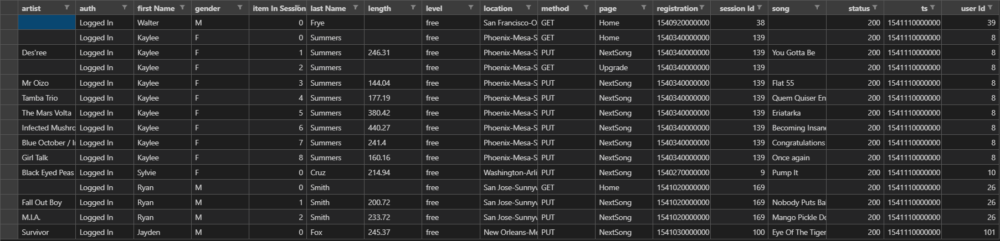
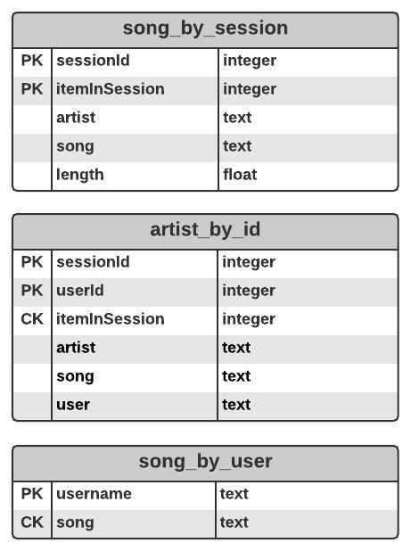

<!--
*** Thanks for checking out the Best-README-Template. If you have a suggestion
*** that would make this better, please fork the repo and create a pull request
*** or simply open an issue with the tag "enhancement".
*** Thanks again! Now go create something AMAZING! :D
-->

<!-- PROJECT SHIELDS -->
<!--
*** I'm using markdown "reference style" links for readability.
*** Reference links are enclosed in brackets [ ] instead of parentheses ( ).
*** See the bottom of this document for the declaration of the reference variables
*** for contributors-url, forks-url, etc. This is an optional, concise syntax you may use.
*** https://www.markdownguide.org/basic-syntax/#reference-style-links
-->
[![LinkedIn][linkedin-shield]][linkedin-url]

<!-- PROJECT LOGO -->
 

  <h3 align="center">ETL Apache Cassandra</h3>

  

    Create a ETL Pipeline for Data Modeling task with Apache Cassandra
     
     
    <a href="https://github.com/BankNatchapol/ETL-Apache-Cassandra/issues">Report Bug</a>
    ·
    <a href="https://github.com/BankNatchapol/ETL-Apache-Cassandra/issues">Request Feature</a>
  

<!-- TABLE OF CONTENTS -->

  
Table of Contents

  <ol>
    <li>
      <a href="#about-the-project">About The Project</a>
    </li>
    <li><a href="#dataset">Dataset</a>
        <ul>
        <li><a href="#event-dataset">Event Dataset</a></li>
      </ul>
    </li>
<li>
      <a href="#getting-started">Getting Started</a>
      <ul>
        <li><a href="#installation">Installation</a></li>
        <li><a href="#etl-processes">ETL Processes</a></li>
      </ul>
    </li>
    <li><a href="#contact">Contact</a></li>
  </ol>

<!-- ABOUT THE PROJECT -->
## About The Project

A startup called Sparkify wants to analyze the data they've been collecting on songs and user activity on their new music streaming app. The analysis team is particularly interested in understanding what songs users are listening to. Currently, there is no easy way to query the data to generate the results, since the data reside in a directory of CSV files on user activity on the app.

They'd like a data engineer to create an Apache Cassandra database which can create queries on song play data to answer the questions, and wish to bring you on the project. Your role is to create a database for this analysis. You'll be able to test your database by running queries given to you by the analytics team from Sparkify to create the results.

<!-- Dataset -->
## Dataset
### Event Dataset
Path files example
>event_data/2018-11-08-events.csv 
>event_data/2018-11-09-events.csv

Below is an example of what the data in a log file, 2018-11-12-events.json, looks like.

### Data Model
This is my database Star Schema.

<!-- GETTING STARTED -->
## Getting Started

### Installation
install package with requirements.txt
> pip install - requirements.txt

### ETL Processes
- run python create_keyspace.py to create keyspace
- run python etl.py to do ETL
- 2.watch results in test.ipynb

<!-- CONTACT -->
## Contact

Facebook - [@Natchapol Patamawisut](https://www.facebook.com/natchapol.patamawisut/)

Project Link: [https://github.com/BankNatchapol/ETL-Apache-Cassandra](https://github.com/BankNatchapol/ETL-Apache-Cassandra)

<!-- MARKDOWN LINKS & IMAGES -->
<!-- https://www.markdownguide.org/basic-syntax/#reference-style-links -->
[linkedin-shield]: https://img.shields.io/badge/-LinkedIn-black.svg?style=for-the-badge&logo=linkedin&colorB=555
[linkedin-url]: https://www.linkedin.com/in/natchapol-patamawisut
